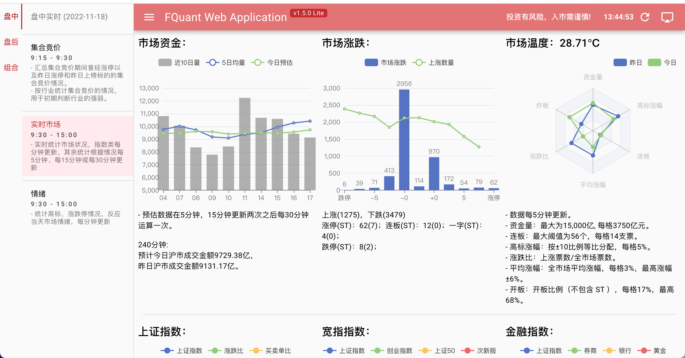
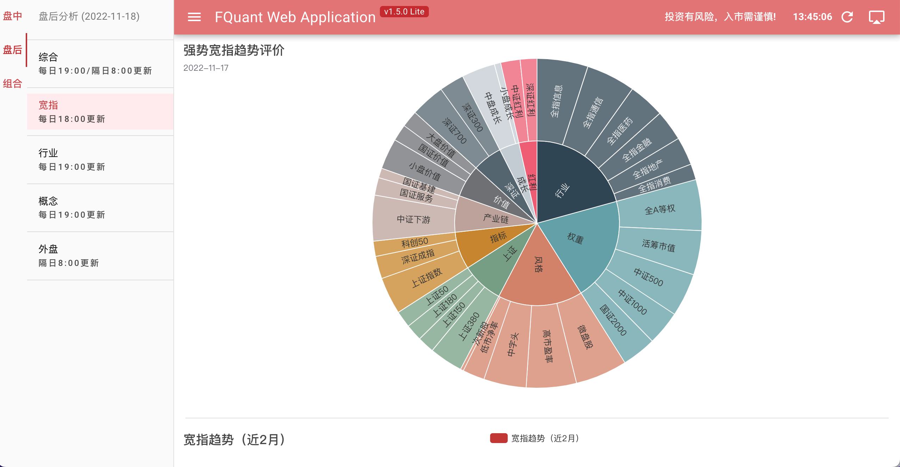
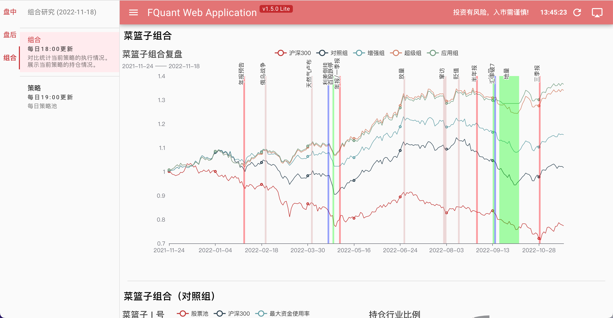

# FQuant Web Lite

Farther Quant（FQuant）是A股市场量化统计分析Lite版本。
您可以通过访问 https://quant.1dian.site 来查看最新版本的展示。

前端使用 vue + quasur 开发。
后端使用 python 开发，后期会陆续开源。

## 项目说明

项目对A股市场盘中、盘后进行量化统计。
盘中每个交易日中实时更新，数据更新频率根据图表形式分成1分钟、5分钟、15分钟、30分钟等周期。
盘后部分没交易日19:00前完成更新
策略部门为项目组目前跟踪的策略执行及净值情况。

## 界面展示






## 使用说明

### 版本说明：
- 该版本为FQuant Application 免费版
- 页面数据需要手工刷新。

### 关于数据
- 基础数据使用通达信，可能会有滞后。
- 盘后数据会在每日19:00之后更新。
- 个别时间可能会因为后台优化出现实盘显示数据不完整的情况

### 关于组合
- 组合为当前自用量化模拟组合的展示。
- 策略为当前量化某策略池的部分运算结果，仅限团队使用或展示。


## 安装部署

### Install the dependencies
```bash
yarn
# or
npm install
```
#### Start the app in development mode (hot-code reloading, error reporting, etc.)
```bash
quasar dev
```

#### Lint the files
```bash
yarn lint
# or
npm run lint
```

#### Format the files
```bash
yarn format
# or
npm run format
```

#### Build the app for production
```bash
quasar build
```

#### Customize the configuration
See [Configuring quasar.config.js](https://v2.quasar.dev/quasar-cli-vite/quasar-config-js).

### 部署
项目没有单独部署的价值，从开发角度，前端仅仅是个工具的展示，使用成熟的 vue + quasar。
如果需要使用可直接通过 https://www.1dian.site 访问使用

## 投资建议

- 本软件为辅助工具，所有的结果均为主观逻辑的量化结果。
- 本软件所展示的个股代码仅为结果展示使用，非荐股。

投资有风险，入市需谨慎。
请咨询持牌投顾。


